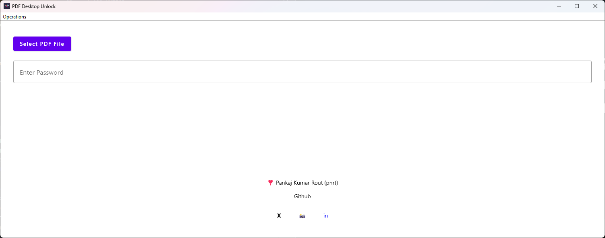
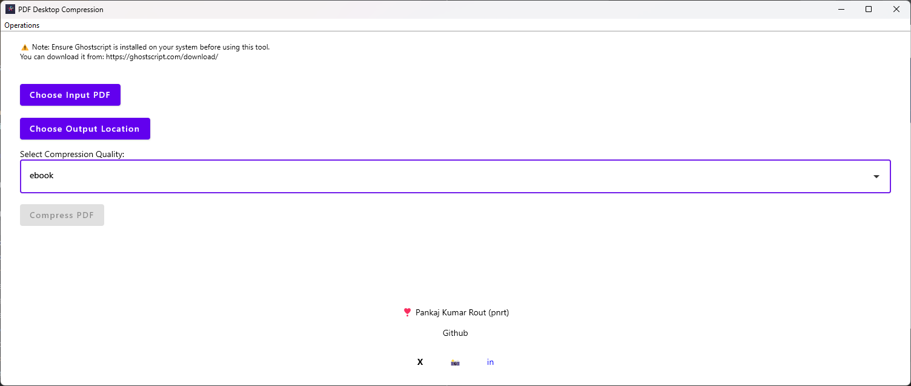

# 📄 PDF Unlocker & Compressor - Windows App


## 🚀 Installation & Usage Guide

### 🛠️ Prerequisites
To run this application on Windows, ensure you have the following installed:

#### 📌 Ghostscript
- Download and install from: [Ghostscript Official Website](https://www.ghostscript.com/download/gsdnld.html)

#### 📌 Java Virtual Machine (JVM)
- Download and install from: [Java SE JDK 11+](https://www.oracle.com/java/technologies/javase-jdk11-downloads.html) (or any compatible version)

### ▶️ Running the Application
1. Ensure **Ghostscript** and **JVM** are installed and properly configured in the system `PATH`.
2. Navigate to the **application directory**.
3. Run the application by double-clicking or executing the script in the command prompt:
   ```sh
   runApp.bat
   ```
4. This will start the application.

### 🛠️ Troubleshooting
If the application does not start, check the following:

✅ Ensure `gswin64c.exe` (Ghostscript) is accessible via the command line.
✅ Verify that Java is properly installed and available in the system `PATH`.
✅ Run `runApp.bat` inside a **command prompt** to check for any error messages.

### 🔹 Additional Notes
- The `.jar` file can be used on **other operating systems** as well.

### 📞 Support
For any issues, feel free to contact **me** or refer to the documentation for the respective dependencies.

---
